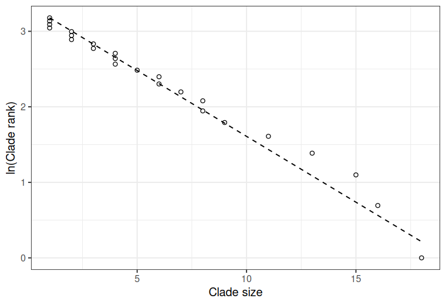
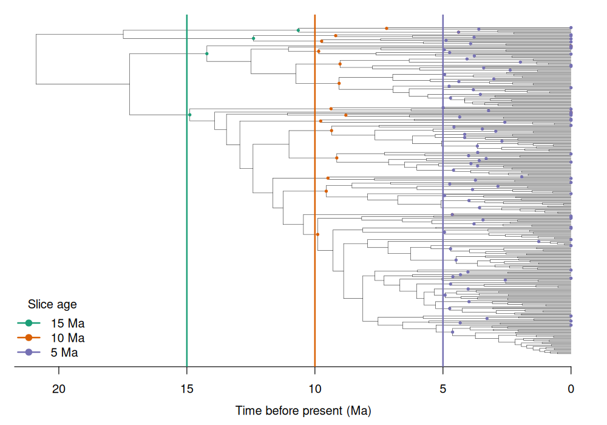
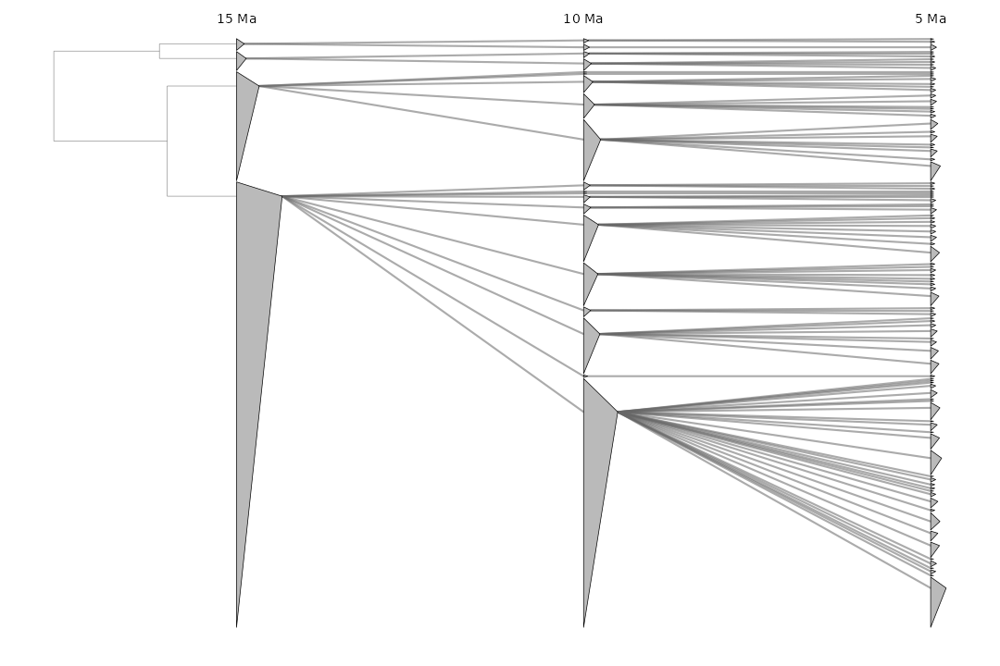

# cladesR

<!-- badges: start -->
<!-- badges: end -->

> R functions for identifying clades in a phylogenetic tree that are larger or smaller than expected based on a homogeneous birth-death model.

## Overview

cladesR provides R functions for finding clades in a dated phylogeny that are
larger or smaller than expected under a homogeneous birth–death model of
diversification. This package allows for reproduction of analyses in Nee et al.
(1992) and Ricklefs (2003, 2014, etc.). You will need an ultrametric phylogeny,
then you can slice it at a given time point in the past, and finally examine the
resulting clades. There are also some plotting functions to keep track of the
clade assignments of lineages. I've written this with Claude Code (Opus 4.8), so
perhaps extra caution is required before using; although I've done some pencil
and paper examples and the functions seem to work as intended. If you notice any
problems or can think of improvements, please open an issue.

## Installation

You can install the development version of cladesR from
[GitHub](https://github.com/vincenzoaellis/cladesR) with:

``` r
# install.packages("remotes")
remotes::install_github("vincenzoaellis/cladesR")
```

cladesR depends on **ape** and **phytools**; **ggplot2** is optional and only
needed for the plotting functions.

## Functions

| Function | What it does |
|----------|--------------|
| `clade_tests()` | Per-clade one-sided tests vs. the geometric null (`too_few` / `too_many`), with optional multiple-testing correction |
| `sd_sim_test()` | Tests the observed SD of clade sizes against the broken-stick (conditional) null of Nee et al. 1992 |
| `geom_expectation()` | Summary statistics + theoretical geometric expectations (SD, SD/mean, Gini–Simpson, proportion singletons) |
| `clade_rank_data()` | ln(rank)-vs-size data and the geometric prediction line (optional ggplot) |
| `extract_clade_sizes()` | Slice an ultrametric tree at a given age and return the resulting clades, sizes, species, and nodes |
| `build_clade_table()` | Species × time-slice clade-membership table (ready for nested ANOVA) |
| `ancestor_descendant_stats()` | Parent→descendant clade-size statistics across adjacent slices |
| `compute_pulse_score()` | Per-tip index of how consistently a lineage sits in over- (or under-) sized clades across many slices |
| `plot_cladetracker()` | Multi-panel "clade tracker" plot linking collapsed clades across time slices |

## Example

### A clade that fits the model (simulated)

``` r
library(cladesR)

# An ultrametric, 30-"Ma"-tall birth-death tree (extant species only).
set.seed(48)
tree <- phytools::pbtree(b = 1, d = 0.4, n = 150, scale = 30, extant.only = TRUE)

# Slice 10 Ma before the present and collect the surviving clades.
slice <- extract_clade_sizes(tree, age_before_present = 10)

# Summary statistics and the theoretical geometric expectations.
geom_expectation(slice$clade_sizes)
#>   n_clades total_species mean_size geom_p observed_sd expected_sd
#> 1       24           150      6.25   0.16    5.084076     5.72822
#>   observed_sd_over_mean expected_sd_over_mean ratio_obs_over_exp simpson_div
#> 1             0.8134521             0.9165151           0.887549   0.9319111
#>   prop_singleton expected_prop_singleton
#> 1      0.1666667                    0.16

# Per-clade tests vs the geometric null -- nothing is flagged here.
clade_tests(slice$clade_sizes)
#>       clade clade_sizes mean_clade_size   p_lower    p_upper too_few too_many
#> 1  clade_01           1            6.25 0.1600000 1.00000000   FALSE    FALSE
#> 2  clade_02           1            6.25 0.1600000 1.00000000   FALSE    FALSE
#> ...
#> 18 clade_18          16            6.25 0.9385575 0.07314578   FALSE    FALSE
#> 24 clade_24          18            6.25 0.9566462 0.05161166   FALSE    FALSE

# Is the spread of clade sizes consistent with the null? (broken-stick test)
sd_sim_test(slice$clade_sizes)
#>   n_clades total_species mean_size observed_sd mean_simulated_sd p_sd_too_large
#> 1       24           150      6.25    5.084076          5.536735      0.6511744
#>   p_sd_too_small p_two_sided
#> 1      0.3523238   0.7046477

# ln(rank)-vs-size, with the geometric prediction line (also draws a ggplot).
clade_rank_data(slice$clade_sizes, plot = TRUE)
```



### A real clade that does not fit the expectations of the homogeneous birth-death model (the avian family Furnariidae, extracted from the `clootl` R package)

``` r
library(clootl)

taxa <- taxonomyGet(taxonomy_year = 2025)
furn <- taxa[taxa$FAMILY == "Furnariidae (Ovenbirds and Woodcreepers)", ]
phy  <- extractTree(species = furn$sci_name_2025)

# At a single 5-Ma slice, several clades are larger than the geometric null
# predicts.
furn5 <- extract_clade_sizes(phy, age_before_present = 5)
subset(clade_tests(furn5$clade_sizes), too_many)
#>        clade clade_sizes mean_clade_size   p_lower    p_upper too_few too_many
#> 7  clade_007           9        3.178218 0.9666375 0.04867895   FALSE     TRUE
#> 19 clade_019           9        3.178218 0.9666375 0.04867895   FALSE     TRUE
#> 52 clade_052           9        3.178218 0.9666375 0.04867895   FALSE     TRUE
#> 9  clade_009          10        3.178218 0.9771347 0.03336252   FALSE     TRUE
#> ...

# Multi-slice workflow: slice at several ages.
ages   <- c(15, 10, 5)
slices <- lapply(ages, function(a) extract_clade_sizes(phy, age_before_present = a))

# Show the tree (tip labels hidden) with each slice in its own color, and the
# clade-defining nodes (the original-tree node rooting each clade, returned in
# `$nodes`) colored to match the slice that produced them.
slice_cols <- c("#1b9e77", "#d95f02", "#7570b3")   # one color per slice age
H <- max(ape::node.depth.edgelength(phy))

ape::plot.phylo(phy, show.tip.label = FALSE, edge.width = 0.4)
ape::axisPhylo()                                   # x-axis: millions of years before present
mtext("Time before present (Ma)", side = 1, line = 2.5)
for (i in seq_along(ages)) {
  abline(v = H - ages[i], col = slice_cols[i], lwd = 2)              # the slice cut
  ape::nodelabels(node = slices[[i]]$nodes, pch = 19,               # its clade nodes
                  col = slice_cols[i], cex = 0.45)
}
legend("bottomleft", legend = paste0(ages, " Ma"), title = "Slice age",
       col = slice_cols, lwd = 2, pch = 19, bty = "n")
```



Each highlight sits at the node rooting a clade: multi-species clades appear at
their crown (just inside the slice), while singletons (clades of one
species/lineage) are marked at their tip. The slices are drawn youngest-last, and
an older singleton falls on the same tip as its younger counterpart, so the
singletons visible at the tips all show the 5 Ma color (the four singletons at
10 Ma are hidden beneath their 5 Ma equivalents).

``` r
# Track how clade sizes change from ancestors to descendants, and score every
# tip for how often it sits in an oversized clade.
ancestor_descendant_stats(build_clade_table(slices, ages))
#>    old_slice  new_slice parent_clade parent_size n_desc mean_desc_size sd_desc_size max_desc_size
#> 1 clade_15Ma clade_10Ma     clade_01         243     11      22.090909     39.33053           136
#> 2 clade_15Ma clade_10Ma     clade_02          60      5      12.000000     13.54622            34
#> 3 clade_15Ma clade_10Ma     clade_03          11      2       5.500000      2.12132             7
#> 4 clade_15Ma clade_10Ma     clade_04           7      2       3.500000      0.70711             4
#> 5 clade_10Ma  clade_5Ma     clade_01         136     30       4.533333      5.64302            28
#> ...

compute_pulse_score(phy, slice_ages = ages)
#>                   species n_slices n_flagged pulse_fraction pulse_score clade_5Ma flagged_5Ma ...
#> 1 Cranioleuca semicinerea        3         3              1    9.519802 clade_001        TRUE ...
#> 2 Cranioleuca subcristata        3         3              1    9.519802 clade_001        TRUE ...
#> ...

# Visualize the clade assignments through time.
plot_cladetracker(phy, slice_list = slices, slice_ages = ages)
```



### Partitioning trait variance across clade levels

`build_clade_table()` turns the slices into a taxonomy-style table: one row per
species, one column per time slice, each cell holding the monophyletic clade the
species belongs to at that depth. Because the columns are nested grouping
factors, you can partition the variance of a trait across phylogenetic levels.

``` r
ctab <- build_clade_table(slices, ages)
head(ctab)
#>                   species clade_15Ma clade_10Ma clade_5Ma
#> 1 Cranioleuca albicapilla   clade_01   clade_01 clade_001
#> 2    Cranioleuca albiceps   clade_01   clade_01 clade_001
#> 3 Cranioleuca antisiensis   clade_01   clade_01 clade_001
#> ...

# A simulated, normally distributed trait (substitute a real measurement here).
set.seed(42)
ctab$trait <- rnorm(nrow(ctab))

# Nested random effects -> variance component (and % of total) at each depth.
library(lme4)
fit <- lmer(trait ~ 1 + (1 | clade_15Ma / clade_10Ma / clade_5Ma), data = ctab)
vc  <- as.data.frame(VarCorr(fit))
vc  <- vc[c(rev(seq_len(nrow(vc) - 1)), nrow(vc)), ]  # oldest level first, residual last
data.frame(level = vc$grp, variance = round(vc$vcov, 4),
           pct = round(100 * vc$vcov / sum(vc$vcov), 1))
#>                               level variance pct
#> 1                        clade_15Ma   0.0000   0
#> 2             clade_10Ma:clade_15Ma   0.0000   0
#> 3 clade_5Ma:(clade_10Ma:clade_15Ma)   0.0000   0
#> 4                          Residual   0.9416 100
```

Because this trait is just random noise with no phylogenetic structure, all of
the variance is residual -- here the residual is the variance among lineages
that share the same base-level (youngest) clade (here the 5 Ma clade).

## References

- Nee S, Mooers AO, Harvey PH (1992) Tempo and mode of evolution revealed from
  molecular phylogenies. *PNAS* 89:8322–8326.
  <https://doi.org/10.1073/pnas.89.17.8322>
- Ricklefs RE (2003) Global diversification rates of passerine birds. *Proc. R.
  Soc. B* 270:2285–2291. <https://doi.org/10.1098/rspb.2003.2489>
- Ricklefs RE (2005) Small clades at the periphery of passerine morphological
  space. *Am. Nat.* 165:651–659. <https://doi.org/10.1086/429676>
- Ricklefs RE (2014) Reconciling diversification: random pulse models of
  speciation and extinction. *Am. Nat.* 184:268–276.
  <https://doi.org/10.1086/676642>
- Kendall DG (1948) On the generalized "birth-and-death" process. *Ann. Math.
  Stat.* 19:1–15. <https://doi.org/10.1214/aoms/1177730285>

## License

GPL-2.
